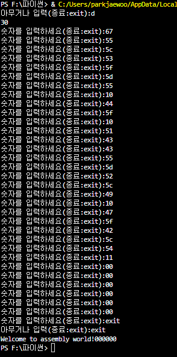

# xorTool
드림핵의 어셈블리어 문제를 풀때 사용했던 코드입니다.
16진수 0x30과 각 주소들에 저장된 16진수들을 xor 연산하여 나온 값을 아스키코드로 변환하여
문제를 풀었습니다.<
-----실행화면------ 
 
-----소스코드----- 

<table class="colorscripter-code-table" style="margin:0;padding:0;border:none;background-color:#fafafa;border-radius:4px;" cellspacing="0" cellpadding="0"><tr><td style="padding:6px;border-right:2px solid #e5e5e5">

1

2

3

4

5

6

7

8

9

10

11

12

13

14

15

16

17

18

19

20

21

22

23

24

</td><td style="padding:6px 0;text-align:left">

def&nbsp;XC():

&nbsp;&nbsp;&nbsp;&nbsp;list=[]

&nbsp;&nbsp;&nbsp;&nbsp;a=int('0x'+input(),16)#입력한&nbsp;16진수를&nbsp;10진수로&nbsp;변환

&nbsp;&nbsp;&nbsp;&nbsp;while(True):

&nbsp;&nbsp;&nbsp;&nbsp;&nbsp;&nbsp;&nbsp;&nbsp;mode=input("숫자를&nbsp;입력하세요(종료:exit):")#xor연산에&nbsp;사용할&nbsp;16진수&nbsp;0x를&nbsp;빼고&nbsp;입력합니다.

&nbsp;&nbsp;&nbsp;&nbsp;&nbsp;&nbsp;&nbsp;&nbsp;if(mode=="exit"):#입력값이&nbsp;exit면&nbsp;반복문으&nbsp;종료함

&nbsp;&nbsp;&nbsp;&nbsp;&nbsp;&nbsp;&nbsp;&nbsp;&nbsp;&nbsp;&nbsp;&nbsp;break

&nbsp;&nbsp;&nbsp;&nbsp;&nbsp;&nbsp;&nbsp;&nbsp;mode=int("0x"+mode,16)#입력받은&nbsp;16진수를&nbsp;10진수로&nbsp;변환

&nbsp;&nbsp;&nbsp;&nbsp;&nbsp;&nbsp;&nbsp;&nbsp;mode=a^mode#입력한&nbsp;2개의&nbsp;16진수를&nbsp;xor연산

&nbsp;&nbsp;&nbsp;&nbsp;&nbsp;&nbsp;&nbsp;&nbsp;list.append(hex(mode))#다시16진수로&nbsp;바꾸고&nbsp;리스트에&nbsp;추가

&nbsp;&nbsp;&nbsp;&nbsp;return&nbsp;list#list&nbsp;리턴

def&nbsp;zeroXascii(List):

&nbsp;&nbsp;&nbsp;&nbsp;asciiStr=''#초기화

&nbsp;&nbsp;&nbsp;&nbsp;for&nbsp;i&nbsp;in&nbsp;range(0,len(List)):#List의&nbsp;크기만큼&nbsp;반복

&nbsp;&nbsp;&nbsp;&nbsp;&nbsp;&nbsp;&nbsp;&nbsp;List[i]=chr(int(List[i],16))#16진수를&nbsp;10진수로&nbsp;변환한&nbsp;것을&nbsp;아스키코드로&nbsp;변환하여&nbsp;다시저장

&nbsp;&nbsp;&nbsp;&nbsp;&nbsp;&nbsp;&nbsp;&nbsp;asciiStr+=List[i]#리스트를&nbsp;문자열로&nbsp;저장하기위해&nbsp;이코드를&nbsp;작성함

&nbsp;&nbsp;&nbsp;&nbsp;return&nbsp;asciiStr#문자열&nbsp;리턴

a=''

while(True):

&nbsp;&nbsp;&nbsp;&nbsp;b=input("아무거나&nbsp;입력(종료:exit):")

&nbsp;&nbsp;&nbsp;&nbsp;if(b=='exit'):

&nbsp;&nbsp;&nbsp;&nbsp;&nbsp;&nbsp;&nbsp;&nbsp;break

&nbsp;&nbsp;&nbsp;&nbsp;a+=zeroXascii(XC())

print(a)

<a href="http://colorscripter.com/info#e" target="_blank" style="color:#e5e5e5text-decoration:none">Colored by Color Scripter</a>
</td><td style="vertical-align:bottom;padding:0 2px 4px 0"><a href="http://colorscripter.com/info#e" target="_blank" style="text-decoration:none;color:white">cs</a></td></tr></table>

